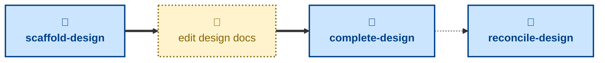

# Agent skills for managing design docs

The skills available to agents in this project are:

- **[scaffold-design](./scaffold-design/):** \
  Cuts a `design/<slug>` branch from `main`, prepares the affected views for
  editing, and opens a pull request in a draft state.

- **[complete-design](./complete-design/):** \
  Checks the design docs describe production as it now is, and merges the
  changes into the `main` trunk.

- **[reconcile-design](./reconcile-design/):** \
  Compares the design docs against the real production system, and
  scaffolds a design change to fix any drift it finds.

The **scaffold-design** prepares changes to the design docs in a draft PR.
After this step, the user edits the design docs. When done, the
**complete-design** skill may be used to get an agent to check over the
changes and land them in the `main` trunk.

These skills handle process, not substance: how a design change is scaffolded,
reviewed, and landed in `main`. For the design work itself — weighing up the
trade-offs and settling on an architecture — use the
[**design**](https://github.com/kieranpotts/skills/tree/latest/dev/skills/design)
skill in my global skills collection.

## Compatibility

These skills are compatible with the [Agent Skills](https://agentskills.io/)
convention. Most agent harnesses support this convention natively, but
workarounds may be required for harnesses that do not.
