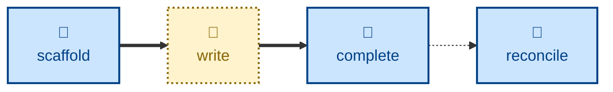

# Agent skills for managing design docs

The skills available to agents in this project are:

- **[scaffold-design](./scaffold-design/):** \
  Scaffolds a changeset to the design docs.

- **[complete-design](./complete-design/):** \
  Lands design doc changes in the `main` trunk.

- **[reconcile-design](./reconcile-design/):** \
  Corrects drift from reality.

The **scaffold-design** prepares changes to the design docs in a draft PR.
After this step, the user edits the design docs. When done, the
**complete-design** skill may be used to get an agent to check over the
changes and land them in the `main` trunk.

## Compatibility

These skills are compatible with the [Agent Skills](https://agentskills.io/)
convention. Most agent harnesses support this convention natively, but
workarounds may be required for harnesses that do not.
