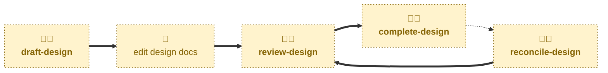

# Agent skills

The following skills are available to support the management of design docs
via AI agents.

- **[draft-design](./draft-design/):** \
  Scaffolds a PR that will propose changes to the system design.
  Cuts a `latest/design/<slug>` branch from `latest/main`, marks up the affected
  views for editing, opens a pull request in a draft state, and opens the linked
  discussion thread.

- **[review-design](./review-design/):** \
  Checks the updated views have real content in them, and takes the pull
  request out of draft.

- **[complete-design](./complete-design/):** \
  Checks the design docs describe production as it now is, merges the
  changes into the `latest/main` trunk, and closes the discussion thread.

- **[reconcile-design](./reconcile-design/):** \
  Sits outside the draft-review-complete progression. Compares the design docs
  on `latest/main` against the real production system, reports any drift it
  finds, and drafts a corrective design change that rejoins the lifecycle at
  review.

## Workflow

The agent skills in this project are focused on the mechanics of managing the
lifecycle of design docs.
For help with evolving the design — weighing up the trade-offs and settling on
architectural solutions to problems — you may instruct agents to use the
[**design**](https://github.com/kieranpotts/skills/tree/latest/dev/skills/design)
skill in my global skills collection.

## Compatibility

These skills are compatible with the [Agent Skills](https://agentskills.io/)
convention. Most agent harnesses support this convention natively, but
workarounds may be required for harnesses that do not.
