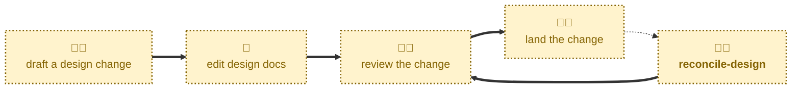

# Reconcile design

Compares the design docs on `main` against the real production system, and
drafts a design change to fix any drift it finds.

The documentation's entire value rests on one promise: that `main` describes
production. Drift breaks that promise. This skill restores it, by walking the
eight views against the code, configuration, and infrastructure that actually
run, reporting every discrepancy, and drafting a correction for the area the
user chooses.

## Interactivity

Interactive. The agent may prompt for the sources of truth to compare against —
those live outside this repository and cannot be assumed — and it presents the
list of discrepancies and asks which to correct before drafting anything. It
does not run unattended.

## How to invoke

> Reconcile design

> The design docs are out-of-date

> Reconcile the design docs

> Check the docs against the code

> The architecture has drifted from the docs

> The deployment moved to multi-region last month, but the physical view
> still shows one region.

## Recommended models

A mid-tier model as a floor, since comparing eight views against a live system
is analysis rather than bookkeeping. Escalate to a stronger reasoning model for
large systems, or where the drift is subtle rather than a plainly renamed or
relocated component.

## Suggested workflows

This skill sits outside the draft-review-complete progression rather than
inside it. That progression documents a change *before* it ships; reconciliation
catches a change that shipped *without* being documented. It is a periodic
health check — worth running after a busy delivery quarter, before an
architecture audit, or whenever someone notices the docs no longer read true.

Its output rejoins the normal lifecycle at review: the corrective pull request
it drafts is reviewed and merged like any other design change. The difference
is only that its merge gate — production must be live first — was satisfied
before drafting began.

## Related skills

- [**draft-design**](../draft-design/) \
  Scaffolds a forward-looking design change, for architecture that is about to
  ship. This skill instead corrects documentation for architecture that has
  already shipped.

- [**review-design**](../review-design/) \
  Takes the corrective pull request this skill drafts out of its draft state,
  as it would any other design change.

- [**complete-design**](../complete-design/) \
  Merges the corrective pull request into `main`.

## References

- [CONTRIBUTING.md](../../../CONTRIBUTING.md) \
  The repository's documented workflow for introducing a design change, which
  this skill follows when drafting a correction.
