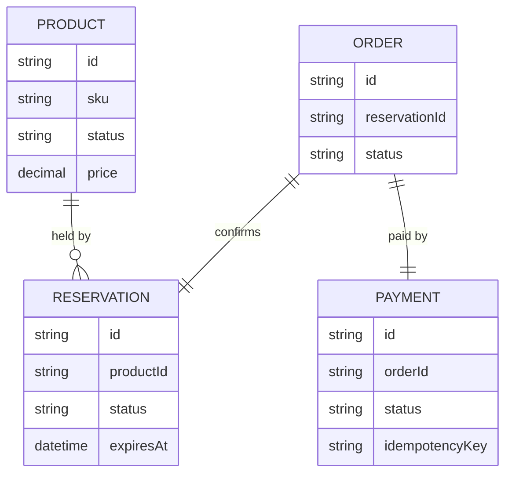

# Crosscutting concepts

This architectural view documents the concepts that apply across the whole
system rather than living in any single component — the domain model, and the
system-wide approaches to persistence, security, error handling, and
observability.

This is a cross-cutting viewpoint rather than a discrete abstraction level.
Where the [scenarios](../scenarios/) view threads specific behaviors through the
other views, this view captures the recurring, system-wide _concerns_ that those
behaviors rely on. It answers the question "how does the system handle this
consistently, everywhere?" — so that a concept is described once, here, instead
of being rediscovered component by component.

It includes:

- **Domain model.** The shared entities and relationships the architecture is
  built around, and the language used to describe them. This describes the
  model as the system realizes it. The authoritative domain model lives in the
  system's [requirements specification](https://github.com/kieranpotts/specs),
  which this view cross-references.

- **Persistence and data.** How state is stored and represented as a consistent
  concept across the system — data ownership, the shape of the stores, and the
  conventions components follow when reading and writing.

- **Security.** The system-wide approach to authentication, authorization,
  secrets, and trust boundaries — the concerns every component inherits rather
  than solves for itself.

- **Error and failure handling.** The consistent approach to errors, retries,
  timeouts, and recovery — how failures surface and propagate across components.

- **Observability.** The logging, metrics, and tracing conventions the whole
  system adheres to, so behavior is legible in production.

- **Other system-wide concerns.** Where they materially shape the architecture,
  concepts such as internationalization, session and state handling, build and
  release, or API conventions each earn a place here.

Keep each concept descriptive and decision-free. Where a concept is the result
of a significant decision, link to the [RFC](https://github.com/kieranpotts/rfc)
that records it rather than restating the reasoning. Cross-reference the views
that realize each concept, and the [scenarios](../scenarios/) that exercise it.

## Example: Acme Catalog & Storefront platform

> [!NOTE]
> This is a sample crosscutting-concepts view, included to illustrate the
> format. It describes a fictional catalog and storefront platform for a
> fictional project ("acme") and is not one of this project's real
> architectural views.

### Domain model

The architecture realizes the domain model defined in the [Acme Catalog API
SRS](https://github.com/kieranpotts/specs). The core entities, as the
architecture represents them:

`Product` and `Reservation` are owned by `catalog-service`; `Order` and
`Payment` are owned by `payments-service`. An `Order` references a
`Reservation` by ID rather than sharing a database — see
[persistence](#persistence-and-data) below.

### Persistence and data

Each domain service owns its own PostgreSQL database exclusively; no service
reads another service's tables directly. Cross-service references (e.g. an
`Order` pointing at a `Reservation`) are held as opaque IDs, resolved by
calling the owning service's API, never by a cross-database join. Reservations
carry a 60-second time-to-live; an unconfirmed reservation is automatically
released by a scheduled job in `catalog-service`, bounding how long a checkout
failure can hold a product unavailable — see the [payment provider outage
scenario](../scenarios/payment-provider-outage.md).

### Security

All inbound requests to `storefront-api` carry a bearer token issued by Auth0;
`storefront-api` validates the token on every request and forwards a verified,
signed internal service-identity header to `catalog-service` and
`payments-service`, so those services trust `storefront-api` within the
cluster network boundary rather than re-validating the end-user token
themselves. Secrets (database credentials, the Stripe API key, SES
credentials) are stored in AWS Secrets Manager and injected into pods at
startup; they are never committed to a repository or baked into an image.

### Error and failure handling

Synchronous calls between services use a bounded timeout (5 seconds) and a
capped retry with exponential backoff (2 retries) for idempotent operations
only; payment authorization is treated as idempotent via a client-supplied
idempotency key so a retried request cannot double-charge. A failure that
survives retries is surfaced to the caller as an explicit error, not masked —
demonstrated in the [payment provider outage
scenario](../scenarios/payment-provider-outage.md). Event consumption in
`notification-worker` is at-least-once; consumers are written to tolerate
duplicate delivery rather than relying on exactly-once guarantees.

### Observability

Every backend service emits structured JSON logs to stdout, collected by the
cluster's logging pipeline, and exposes Prometheus-format metrics on
`/metrics`. A correlation ID generated at `storefront-api` is propagated on
every downstream HTTP call and every published event, so a single checkout
request can be traced across `catalog-service`, `payments-service`, and
`notification-worker` in the shared trace backend.

### API conventions

All synchronous inter-service APIs are JSON over HTTPS, versioned in the URL
path (e.g. `/v1/reservations`), and follow the same error-response shape
(`{"error": {"code", "message"}}`) across all four backend services, defined
once in `acme/domain-kit` (see the [development view](../development/)) and
consumed by every service rather than reimplemented.
