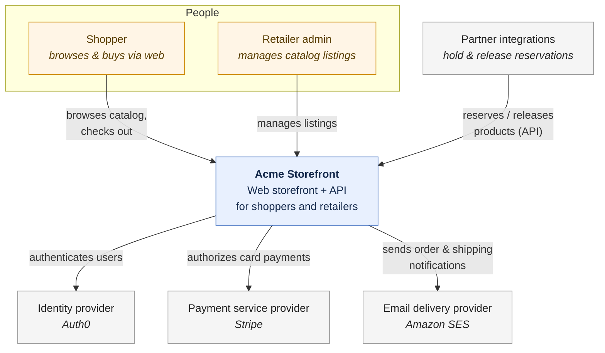
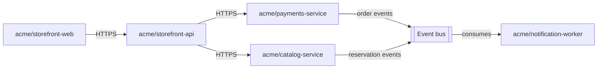

# Conceptual view

This is a strategic, whole-system overview. It names the system's major
parts and shows how they fit together, without going into how any part is built
or run.

It includes:

- **The shape of the whole.** The overarching architectural style, eg. a modular
  monolith, a set of services, an event-driven backbone.

- **System landscape.** The system in relation to its users, the external
  systems it depends on, and the systems that depend on it. C4-style system
  context diagrams, authored in text, are used for these models.

- **Major parts.** The handful of top-level building blocks the system is
  composed of — the pieces a newcomer must know to orient themselves — and a
  short text description of what they are each for.

- **How the parts fit together.** The principal relationships and information
  flows between those parts, at a strategic level.

This is the most abstract of all the architectural models. As such, it is a good
entry point for technical people onboarding to the project. It is also the most
useful view for non-technical stakeholders.

## Example: Acme Catalog & Storefront platform

> [!NOTE]
> This is a sample conceptual view, included to illustrate the format. It
> describes a fictional catalog and storefront platform for a fictional project
> ("acme") and is not one of this project's real architectural views.

### The shape of the whole

The Acme Catalog & Storefront platform is a modular, service-oriented
architecture. It consists of a small number of independently deployable services,
each owning a distinct area of responsibility, communicating over synchronous HTTP
for request/response work and an asynchronous event bus for workflows that
outlive a single request. It is neither a single monolith nor a fine-grained
microservices mesh — the service boundaries are drawn around durable business
capabilities (catalog, payments, notifications), not individual features.

The platform realizes the requirements captured in the [Acme Catalog API
SRS](https://github.com/kieranpotts/specs) — an authoritative product catalog
with reservation and checkout capabilities, serving retailers, their technology
partners, and shoppers buying directly.

### System landscape

### Major parts

- **`acme/storefront-web`** — The public-facing web application shoppers and
  retailer admins use. Renders the catalog, cart, and checkout flow.

- **`acme/storefront-api`** — The API gateway / backend-for-frontend that
  `storefront-web` and partner integrations call. Aggregates catalog and
  payment data into shopper- and partner-facing responses.

- **`acme/catalog-service`** — Owns the product catalog, listings, and
  reservation state. The architectural realization of the [Acme Catalog
  API](https://github.com/kieranpotts/specs) domain.

- **`acme/payments-service`** — Owns payment authorization, capture, and
  refunds, integrating with the Stripe payment service provider. See the
  [payments-service audit](https://github.com/kieranpotts/audits) and
  [payment-flow risk register](https://github.com/kieranpotts/risks) for
  related standalone assessments.

- **`acme/notification-worker`** — Consumes order and shipping events
  asynchronously and sends transactional emails via Amazon SES. See the
  [notification-worker audit](https://github.com/kieranpotts/audits).

### How the parts fit together

The gateway (`storefront-api`) is the only component that talks directly to
both `catalog-service` and `payments-service` for request/response work;
`notification-worker` is decoupled from both, reacting only to events on the
bus. See the [logical view](../logical/) for the full component breakdown, and
the [checkout scenario](../scenarios/) for how these parts collaborate
end-to-end.
