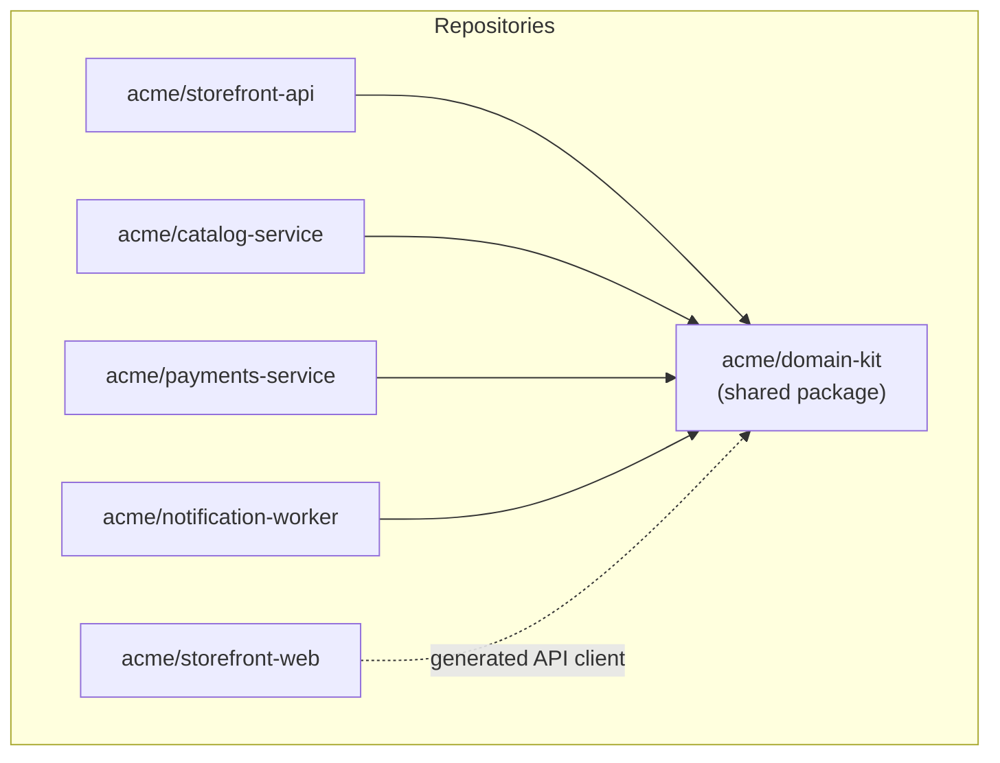

# Development view

This view describes the static organization of the implementation — the
repositories the code is divided between, the dependencies between them, the
filesystem structures within each repository, and the build and packaging
artifacts that are produced.

Code, as it exists on disk, is mapped to the [logical](../logical/)
architecture. This is one of the most useful views for developers, as it answers
the question "how is the codebase laid out?"

It includes:

- **Code organization.** The repositories, modules, packages, and layers the
  implementation is divided into, and the responsibility of each. Directory and
  package diagrams are useful here.

- **Layering and dependency rules.** The permitted dependency directions between
  layers or modules — what may depend on what, and what must not.

- **Build and packaging artifacts.** What the build produces — libraries,
  services, images, bundles — and how the source maps to those artifacts.

- **Shared code and ownership.** Shared libraries, internal packages, and
  code-ownership boundaries between teams, where relevant.

- **Mapping to the logical view.** Which modules realize which
  [logical](../logical/) components, especially where one does not map cleanly
  onto the other.

## Example: Acme Catalog & Storefront platform

> [!NOTE]
> This is a sample development view, included to illustrate the format. It
> describes a fictional catalog and storefront platform for a fictional project
> ("acme") and is not one of this project's real architectural views.

### Code organization

Each [logical](../logical/) component lives in its own repository, one build
artifact per repository:

- **`acme/storefront-web`** — Next.js application, deployed as a static/SSR
  bundle to a CDN-fronted Node.js runtime.
- **`acme/storefront-api`** — Express application, built as a Docker image.
- **`acme/catalog-service`** — Express application, built as a Docker image.
- **`acme/payments-service`** — Express application, built as a Docker image.
- **`acme/notification-worker`** — Node.js consumer process, built as a Docker
  image; no HTTP surface.
- **`acme/domain-kit`** — A shared, versioned npm package (private registry)
  containing the domain event schemas, HTTP client SDKs, and logging/tracing
  conventions common to the four backend services.



### Layering and dependency rules

Within each backend service repository, the same three-layer structure is
used:

```
src/
  http/          # inbound adapters: routes, controllers, request/response mapping
  domain/        # business rules, no framework or I/O dependencies
  persistence/   # outbound adapters: repositories, database clients
```

`http/` MAY depend on `domain/`. `domain/` MUST NOT depend on `http/` or
`persistence/`. `persistence/` MAY depend on `domain/` (to implement its
repository interfaces) but MUST NOT depend on `http/`. All four backend
services and `domain-kit` MAY be depended upon by `storefront-api`'s generated
client usage in `storefront-web`, but `domain-kit` MUST NOT depend on any
individual service.

### Build and packaging artifacts

| Repository | Build output | Registry |
|---|---|---|
| `storefront-web` | Docker image (`acme/storefront-web`) | Amazon ECR |
| `storefront-api` | Docker image (`acme/storefront-api`) | Amazon ECR |
| `catalog-service` | Docker image (`acme/catalog-service`) | Amazon ECR |
| `payments-service` | Docker image (`acme/payments-service`) | Amazon ECR |
| `notification-worker` | Docker image (`acme/notification-worker`) | Amazon ECR |
| `domain-kit` | npm package | GitHub Packages (private) |

Each repository builds and pushes its image on merge to `main`, tagged with
the commit SHA; the [physical view](../physical/) describes how those images
are deployed. Branching and merge conventions follow RFC 0003 (trunk-based
branching), and all repositories are hosted on GitHub per RFC 0002.

### Shared code and ownership

`domain-kit` is owned jointly by the backend service teams; changes to its
public API require review from at least one maintainer outside the proposing
team, since a breaking change there ripples across every consumer.
`storefront-web` owns its own UI component library and does not share it with
any backend repository.

### Mapping to the logical view

The mapping from repository to [logical](../logical/) component is 1:1 for all
five deployable repositories — there is no repository that implements more
than one logical component, and no logical component split across
repositories. `domain-kit` does not map to any single logical component; it is
cross-cutting infrastructure shared by all of them.
