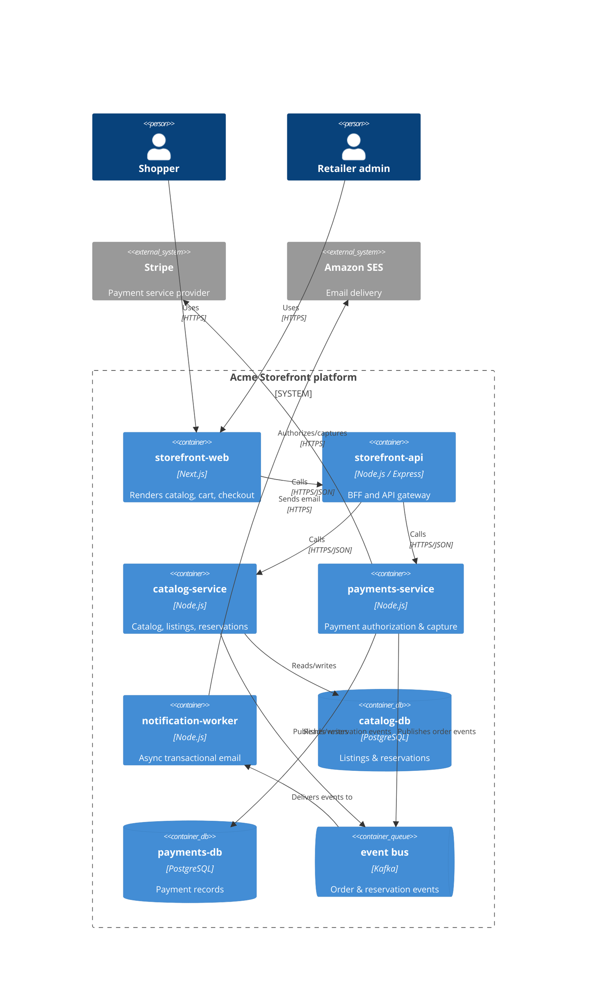
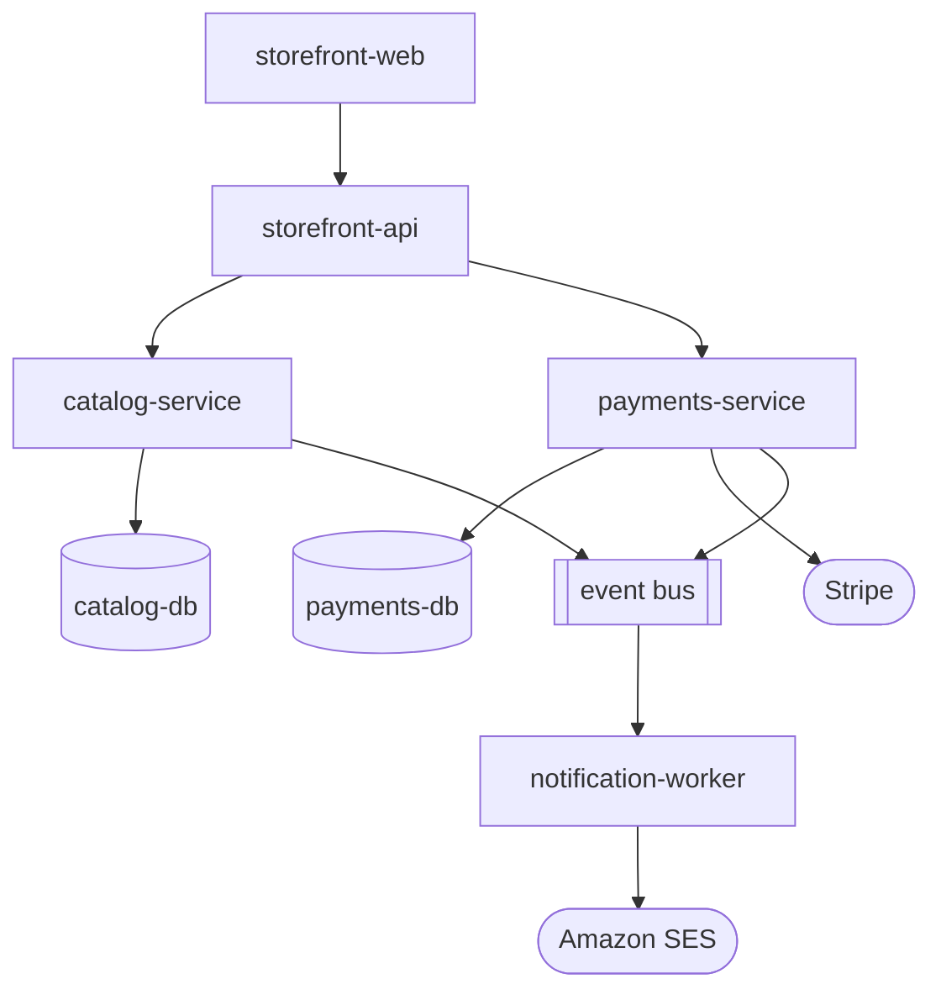

# Logical view

This architectural view decomposes the [conceptual](../conceptual/) architecture
into the major functional components of the system. It describes the
responsibilities of each major component, and how all the components relate.

It includes:

- **Component model.** The major logical components or modules of the system,
  each with a clear, single responsibility. C4-style container and component
  diagrams, authored in text, are used for this model.

- **Responsibilities.** For each component, what it owns and what it
  deliberately does not. Make the boundaries explicit.

- **Relationships.** How components depend on, call, or collaborate with one
  another, and the direction of those dependencies.

- **Key abstractions and patterns.** The architectural patterns the structure
  embodies (layering, hexagonal ports/adapters, event-driven, etc.), described
  as the structure they produce — not as a choice being justified.

- **Domain mapping.** How the logical components relate to the domain model
  defined in the [SRS](https://github.com/kieranpotts/specs), where that mapping
  is not obvious.

## Example: Acme Catalog & Storefront platform

> [!NOTE]
> This is a sample logical view, included to illustrate the format. It
> describes a fictional catalog and storefront platform for a fictional project
> ("acme") and is not one of this project's real architectural views.

### Component model

If the C4-DSL renderer is unavailable, the same structure as a plain flowchart:

### Responsibilities

| Component | Owns | Does not own |
|---|---|---|
| `storefront-web` | Presentation, client-side cart state | Business rules, persistence |
| `storefront-api` | Request aggregation, auth-token validation, shaping responses for `storefront-web` and partners | Catalog or payment business logic |
| `catalog-service` | Product listings, pricing, reservation holds and releases | Payment capture, notification delivery |
| `payments-service` | Payment authorization, capture, refunds, order records | Catalog data, email delivery |
| `notification-worker` | Rendering and sending transactional email in response to events | Originating events, synchronous request handling |

### Relationships

`storefront-api` is the only component that calls both `catalog-service` and
`payments-service` synchronously; those two services never call each other
directly. `catalog-service` and `payments-service` each publish events to a
shared event bus; `notification-worker` only ever consumes from the bus, never
called synchronously by any other component. Dependencies point inward from the
edge (`storefront-web`) toward the domain services, and outward from the domain
services to the event bus — never the reverse.

### Key abstractions and patterns

Each domain service (`catalog-service`, `payments-service`) follows a
lightweight hexagonal structure: an HTTP adapter at the edge, a domain core with
the business rules, and a persistence adapter behind a repository interface.
`storefront-api` is a pure backend-for-frontend — it holds no persistent state
of its own. The event bus decouples publishers from `notification-worker`
entirely; publishers have no knowledge of which consumers exist.

### Domain mapping

`catalog-service` is the architectural realization of the **Acme Catalog API**
domain defined in the SRS — see the
[`catalog-read-api`](https://github.com/kieranpotts/specs),
[`reservations`](https://github.com/kieranpotts/specs), and
[`search-by-tag`](https://github.com/kieranpotts/specs) proposals.
`payments-service` realizes the
[`checkout-and-payments`](https://github.com/kieranpotts/specs) proposal.
