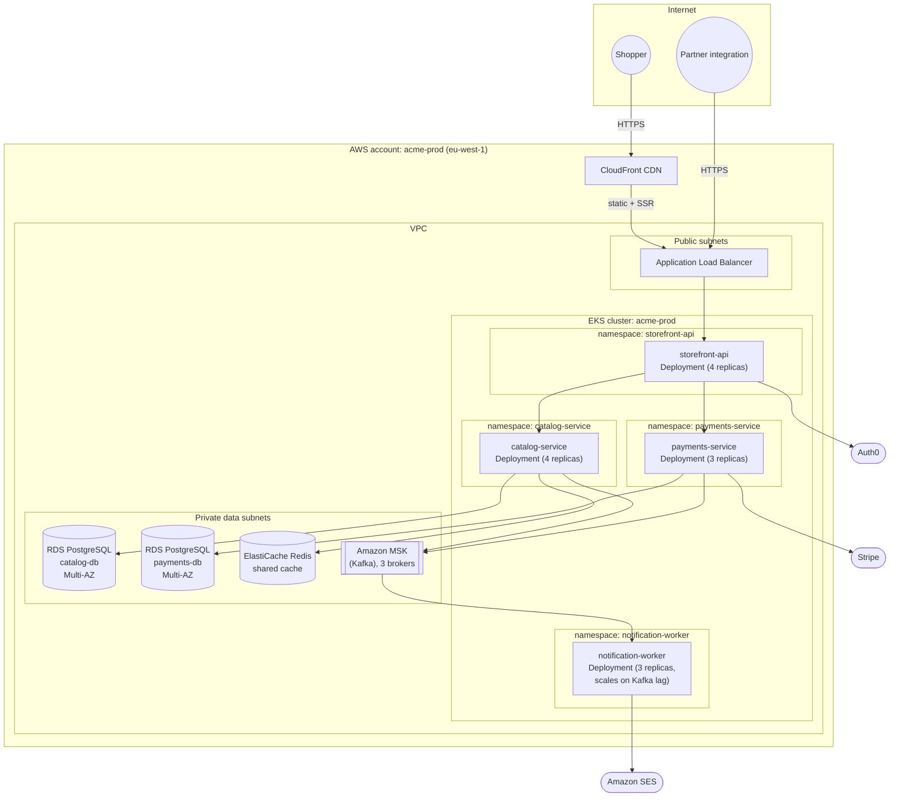

# Deployment topology — Acme Catalog & Storefront platform

> [!NOTE]
> This is a sample deployment topology, included to illustrate the format. It
> describes a fictional catalog and storefront platform for a fictional project
> ("acme") and is not one of this project's real architectural views. It is
> referenced from the [physical view README](./README.md).

## Production environment

## Environments

| Environment | Cluster | Notes |
|---|---|---|
| Production (`acme-prod`) | EKS, `eu-west-1`, 3 AZs | Multi-AZ RDS, 3-broker MSK, autoscaling 3–10 replicas per service |
| Staging (`acme-staging`) | EKS, `eu-west-1`, 2 AZs | Single-AZ RDS, 1-broker MSK, fixed 1 replica per service |
| Development | Local Docker Compose, or ephemeral per-PR namespace in `acme-staging` | Uses LocalStack for AWS service stand-ins |

Staging mirrors production topology at reduced scale and redundancy; it does
not have a separate CloudFront distribution — `storefront-web` is served
directly from the ALB in non-production environments.

## Networks and boundaries

- The VPC is split into public subnets (ALB only) and private subnets (EKS
  nodes and all data stores). No data store is reachable from the public
  internet.
- The ALB is the single ingress point for all API traffic; CloudFront is the
  single ingress point for `storefront-web` static and SSR content.
- Egress to third parties (Stripe, Amazon SES, Auth0) is permitted only from
  the `payments-service`, `notification-worker`, and `storefront-api`
  namespaces respectively, enforced via Kubernetes network policies.

## Data stores and infrastructure services

- **`catalog-db`** — Amazon RDS for PostgreSQL 16, Multi-AZ in production.
  Owned exclusively by `catalog-service`.
- **`payments-db`** — Amazon RDS for PostgreSQL 16, Multi-AZ in production.
  Owned exclusively by `payments-service`.
- **Shared Redis** — Amazon ElastiCache for Redis 7, used by `catalog-service`
  for listing and search-result caching.
- **Amazon MSK** — 3-broker Kafka cluster in production, hosting the
  `acme.orders` and `acme.reservations` topics.
- **Amazon S3** — object storage for product images, served via CloudFront.

## External dependencies

- **Auth0** — identity provider, called by `storefront-api` to validate bearer
  tokens on every request.
- **Stripe** — payment service provider, called by `payments-service` for
  authorization and capture.
- **Amazon SES** — transactional email delivery, called by
  `notification-worker`.

## Scaling and availability topology

Production spans three availability zones within `eu-west-1`. EKS node groups
and all `Deployment` resources are spread across AZs via pod topology spread
constraints. RDS instances run Multi-AZ with automatic failover. MSK brokers
are one-per-AZ. There is currently no multi-region deployment or DR region;
region-level failure is accepted as an out-of-scope risk (tracked in the
[risk register](https://github.com/kieranpotts/risks)).
