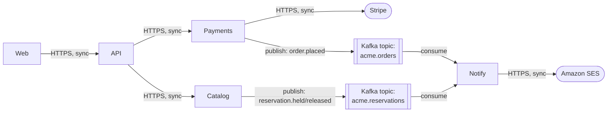
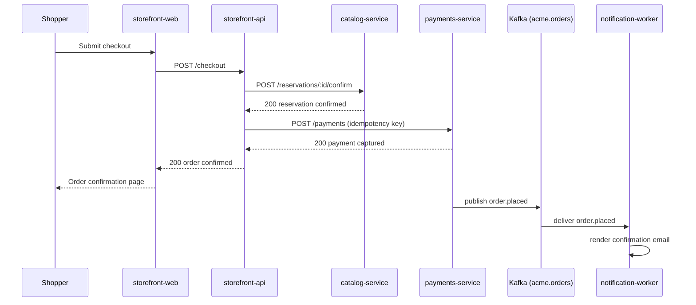

# Process view

This section documents the runtime architecture — the processes, threads, and
services the system runs as, how they communicate and synchronize, and how
concurrency is handled.

This view answers the questions "what is running?", "how is it threaded?", and
"how do those processes talk and synchronize?"

The process view describes _what_ executes and _how_ it behaves at runtime, but
it does not describe _where_ those executables are run – see the
[physical](../physical/) view for that. The same process structure could be
deployed across very different topologies without changing.

It includes:

- **Runtime units.** The processes, services, daemons, workers, and significant
  threads or thread pools the system runs as, and the responsibility of each.

- **Communication.** How the runtime units communicate — synchronous calls,
  message queues, event streams, shared stores — and the direction and protocols
  of those interactions, described behaviorally.

- **Concurrency and synchronization.** How concurrent work is coordinated:
  parallelism, locking, transactions, idempotency, ordering guarantees,
  back-pressure.

- **Lifecycle and control.** How runtime units start, stop, scale, recover, and
  fail over; scheduled or triggered work; health and readiness behavior.

- **Sequence and activity diagrams.** Text-authored diagrams of important
  runtime interactions.

## Example: Acme Catalog & Storefront platform

> [!NOTE]
> This is a sample process view, included to illustrate the format. It
> describes a fictional catalog and storefront platform for a fictional project
> ("acme") and is not one of this project's real architectural views.

### Runtime units

| Runtime unit | Kind | Responsibility |
|---|---|---|
| `storefront-web` | HTTP server (Node.js, Next.js SSR) | Serves the storefront UI |
| `storefront-api` | HTTP server (Node.js, Express) | Aggregates catalog and payment data |
| `catalog-service` | HTTP server (Node.js, Express) | Serves and mutates catalog & reservation state |
| `payments-service` | HTTP server (Node.js, Express) | Authorizes and captures payments |
| `notification-worker` | Long-running consumer (Node.js) | Consumes events, sends email |

Each HTTP server runs as multiple replica processes behind a load balancer (see
[physical view](../physical/)); `notification-worker` runs as a consumer group
with one process per Kafka partition assigned.

### Communication

Requests from `storefront-web` through to `catalog-service` / `payments-service`
are synchronous request/response over HTTPS with JSON payloads. Order and
reservation state changes are additionally published as events;
`notification-worker` is the only consumer of those topics today.

### Concurrency and synchronization

Each domain service is stateless between requests; all durable state lives in
its own PostgreSQL database (see [physical view](../physical/)). Reservation
holds in `catalog-service` are made under a row-level lock (`SELECT ... FOR
UPDATE`) to prevent two concurrent requests from double-booking the same
product. `payments-service` treats payment authorization as idempotent,
keyed on a client-supplied idempotency key, so a retried checkout request never
double-charges. Kafka consumers in `notification-worker` commit offsets only
after the email send succeeds, so a crash mid-send results in at-least-once
redelivery — email rendering is written to tolerate duplicate delivery.

### Lifecycle and control

All five runtime units are container processes managed by Kubernetes (see
[physical view](../physical/)). HTTP servers expose `/healthz` (liveness) and
`/readyz` (readiness, checks database connectivity) endpoints polled by the
platform. `notification-worker` reports liveness via a heartbeat file checked
by the container runtime, since it has no HTTP surface. All units scale
horizontally on CPU utilization; `notification-worker` additionally scales on
Kafka consumer lag.

### Sequence diagram: checkout request

See the [checkout scenario](../scenarios/) for the full cross-view trace of
this flow.
