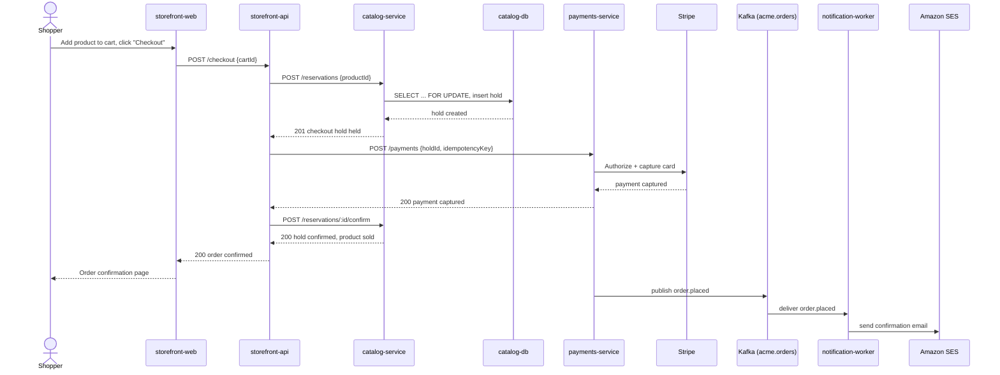

# Scenario: Checkout

> [!NOTE]
> This is a sample scenario, included to illustrate the format. It describes a
> fictional catalog and storefront platform for a fictional project ("acme")
> and is not one of this project's real architectural views. It is referenced
> from the [scenarios view README](./README.md).

This scenario traces a shopper reserving a product and completing payment —
the [`checkout-and-payments`](https://github.com/kieranpotts/specs) journey —
end-to-end through the architecture.

## Trace

## Views exercised

- **[Logical](../logical/)** — `storefront-api`, `catalog-service`, and
  `payments-service` collaborate synchronously; `notification-worker` reacts
  asynchronously. See the [component model](../logical/#component-model).
- **[Process](../process/)** — the synchronous HTTP calls and the
  `order.placed` event publication follow the [communication
  patterns](../process/#communication) and the idempotency guarantee
  described under [concurrency and
  synchronization](../process/#concurrency-and-synchronization).
- **[Physical](../physical/)** — all requests enter through the ALB and are
  routed to pods within the `acme-prod` EKS cluster; see the [deployment
  topology](../physical/deployment-topology.md).
- **[Technical](../technical/)** — the checkout hold uses a PostgreSQL
  row-level lock; the event bus is Amazon MSK (Kafka); see the
  [technical view](../technical/).
- **[Concepts](../concepts/)** — payment idempotency and checkout-hold
  consistency are instances of the system-wide [error and failure
  handling](../concepts/) and [persistence](../concepts/) concepts.

## Notes

If the payment authorization step fails, the checkout hold is released
rather than confirmed — see the [payment provider outage
scenario](./payment-provider-outage.md) for that path.
