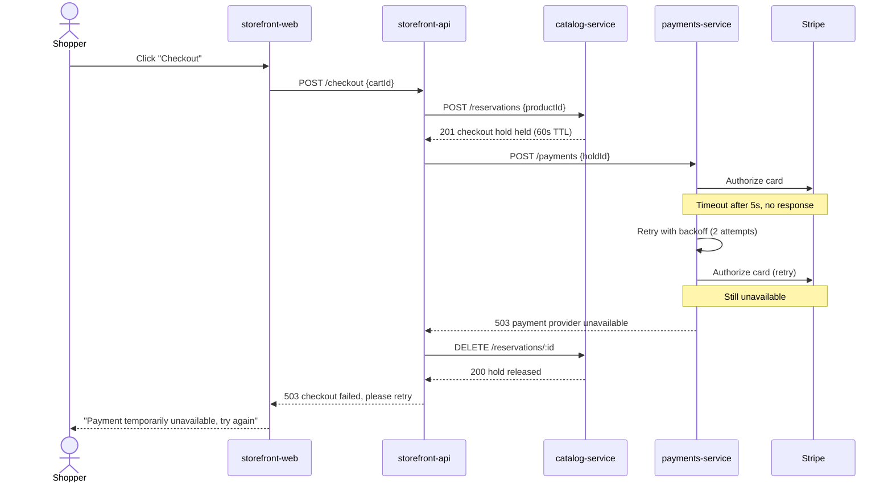

# Scenario: Payment provider outage

> [!NOTE]
> This is a sample scenario, included to illustrate the format. It describes a
> fictional catalog and storefront platform for a fictional project ("acme")
> and is not one of this project's real architectural views. It is referenced
> from the [scenarios view README](./README.md).

This scenario traces a failure-and-recovery path: what happens when Stripe,
the external payment service provider, is unavailable during checkout.

## Trace

## Views exercised

- **[Process](../process/)** — `payments-service` applies the retry-with-
  backoff pattern described in [lifecycle and
  control](../process/#lifecycle-and-control); `storefront-api` surfaces the
  failure rather than masking it.
- **[Concepts](../concepts/)** — this is the canonical illustration of the
  system-wide [error and failure handling](../concepts/) concept: an
  unavailable external dependency degrades to an explicit, retryable failure
  rather than a silent inconsistency. It also demonstrates the checkout-hold
  time-to-live safeguard described under [persistence](../concepts/), which
  bounds how long a hold can block a product if a release call is itself
  never made.
- **[Physical](../physical/)** — Stripe is an external dependency reached only
  from the `payments-service` namespace; see [external
  dependencies](../physical/deployment-topology.md#external-dependencies).

## Related risk

The behavior of `payments-service` under sustained provider outage is one of
the scenarios examined in the fictional [Acme payment flow risk
workshop](https://github.com/kieranpotts/risks).
